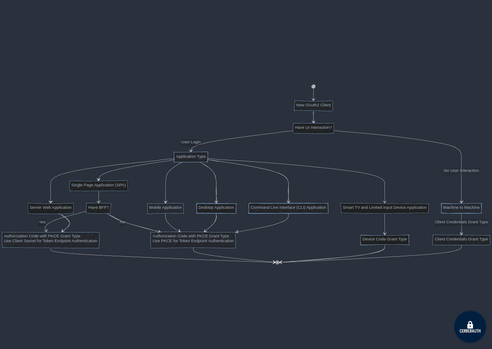

    

---

# Nacho - New OAuth 2.0 (and OpenID Connect) Client Creation Helper

Nacho helps you choose the right Grant Type, then create an OAuth 2.0 client for your use case.

It is designed to be used by developers and non-developers alike, and it is meant to be a simple and easy-to-use tool to help you create OAuth 2.0 clients for your applications.

## Table of Contents

- [Features](#features)
- [Contributing](#contributing)

## State Diagram

## Features

- Choose Grant Type (Flow)
- Prepare New Client creation request

## Contributing

If you would like to contribute to Nacho, please fork the repository and submit a pull request. We welcome contributions from the community, and we are always looking for ways to improve Nacho.

## License

Nacho is licensed under the MIT License. See the [LICENSE](./LICENSE) file for more information.
