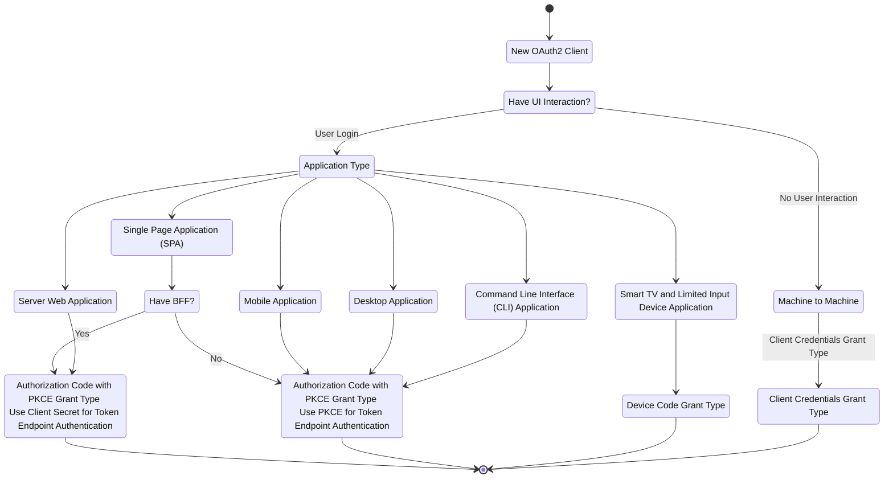

# Grant Type Choice State Diagram

```mermaid
stateDiagram-v2
    [*] --> new_oauth2_client
    new_oauth2_client: New OAuth2 Client
    new_oauth2_client --> if_have_ui_interaction

    if_have_ui_interaction: Have UI Interaction?
    if_have_ui_interaction --> machine_to_machine: No User Interaction
    if_have_ui_interaction --> application_type: User Login

    application_type: Application Type
    application_type --> spa
    application_type --> server_web_application
    application_type --> mobile_application
    application_type --> desktop_application
    application_type --> cli_application
    application_type --> smart_tv_and_limited_input_device_application

    spa: Single Page Application (SPA)
    spa --> have_bff
    have_bff: Have BFF?
    have_bff --> authorization_code_with_pkce_and_secret: Yes
    have_bff --> authorization_code_with_pkce_without_secret: No

    server_web_application: Server Web Application
    server_web_application --> authorization_code_with_pkce_and_secret

    mobile_application: Mobile Application
    mobile_application --> authorization_code_with_pkce_without_secret

    desktop_application: Desktop Application
    desktop_application --> authorization_code_with_pkce_without_secret

    cli_application: Command Line Interface (CLI) Application
    cli_application --> authorization_code_with_pkce_without_secret

    smart_tv_and_limited_input_device_application: Smart TV and Limited Input Device Application
    smart_tv_and_limited_input_device_application --> device_code_grant_type

    machine_to_machine: Machine to Machine
    machine_to_machine --> client_credentials_grant_type: Client Credentials Grant Type

    authorization_code_with_pkce_and_secret: Authorization Code with PKCE Grant Type <br>Use Client Secret for Token Endpoint Authentication
    authorization_code_with_pkce_and_secret --> [*]

    authorization_code_with_pkce_without_secret: Authorization Code with PKCE Grant Type <br>Use PKCE for Token Endpoint Authentication
    authorization_code_with_pkce_without_secret --> [*]

    device_code_grant_type: Device Code Grant Type
    device_code_grant_type --> [*]

    client_credentials_grant_type: Client Credentials Grant Type
    client_credentials_grant_type --> [*]
```
